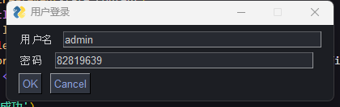
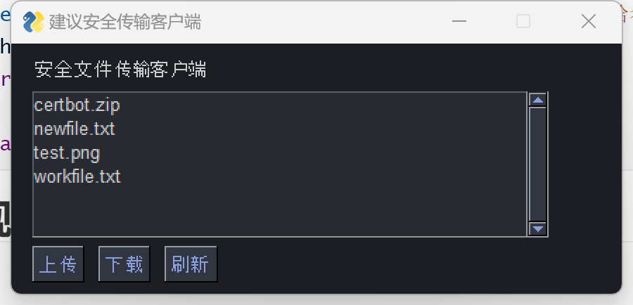
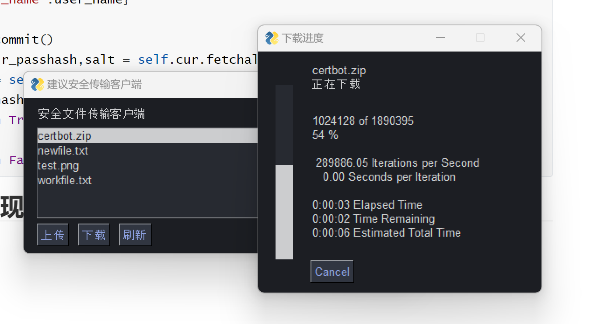
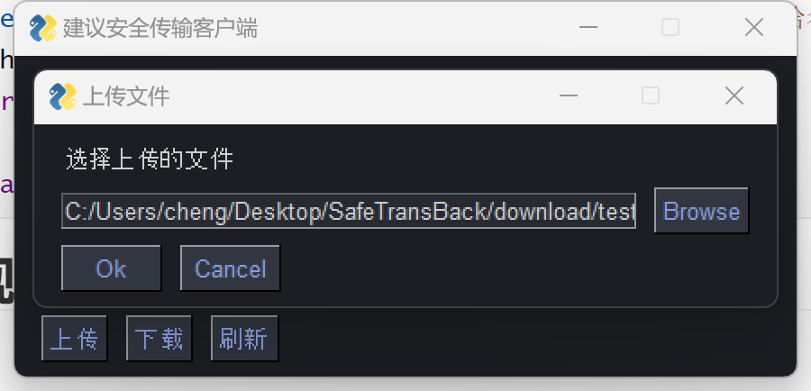

# 安全文件传输软件设计与实现

## 项目技术路线

+ 基于python实现
+ GUI使用PySimpleGUI实现
+ 数据库使用sqlite3轻量级数据库

## 核心功能实现方法

+ 使用threading模块实现多用户并发访问
+ 使用ssl+socket模块实现安全的文件传输可抵御中间人攻击
+ 使用sqlite3数据库预编译功能，抵御SQL注入攻击
+ 使用加盐hash的方法可以抵御脱库等攻击

## 项目结构

+ download：下载文件目录
+ keys：CA，服务端，以及用户端的证书及密钥
+ storage：服务端的文件存储区
+ client.py：用户端接口
+ database.py：sqlite3数据库接口
+ frontend.py：用户端前端程序
+ protocal：协议封装接口
+ server.py：服务端程序

## 协议设计与实现

协议采用定长头部+数据的格式，具体格式如格式1所示，格式1头部4个字节表示指令代码或者回复状态代码，紧跟着0到1k字节为指令或者回复参数。

~~~bash
|CMD/STATE|    DATA		|
| 4 BYTE  | 0-1024 BYTE | 
~~~

<div align="center">
    格式1:文件传输协议格式
</div>

协议封装采用struct模块进行字节级的编码如代码1中所示。

~~~python
def pack(state_cmd,byte_info):
        header = binascii.hexlify(struct.Struct('i').pack(state_cmd['cmd']))
        data = byte_info
        return header + data
    
def unpack(byte_data):
    if len(byte_data) == 0:
        return Proto.STATE_FAIL,b''
    s = struct.Struct('I')
    size = s.size * 2
    header = s.unpack(binascii.unhexlify(byte_data[:size]))
    info = byte_data[size:] if size < len(byte_data) else b''
    return header[0],info
~~~

<div align="center">
    代码1:协议封装
</div>
## 上传与下载协议设计

系统下载与上传过程的通信时序图如图片1和图片2所示。


<div align="center">
    图片1：下载通信时序图
</div>


<div align="center">
   图片2：上传通信时序图（右）
</div>

### 下载

开始下载时，客户端首先向服务端发送CMD_DOWNLOAD请求，参数为要下载文件的名称，服务端在收到请求之后会回复给客户端一个STATE_DOWN_START代码并给出文件大小，然后开始以1kb为单位向用户端传输文件内容并在文件传输结束时向用户端发送STATE_END代码来结束下载过程。

## 上传

上传过程和下载过程类似，客户端首先向服务端发送CMD_UPLOAD，参数为要上传的文件的名称以及文件大小，服务端如果准备就绪会向客户端回复一个STATE_SUCCESS代码，然后开始客户端就会开始以1kb为单位想服务端上传文件并在文件上传结束时向服务端发送CMD_UPLOAD_END指令来终止上传过程。

## 密钥及证书管理

在实验过程中建立密钥系统的过程如下：

1. 生成一个私钥作为CA的私钥，并生成一个相应的自签名证书作为CA的根证书。
2. 为服务器生成一个私钥，并使用CA自身私钥对服务器发出的证书请求做签名生成服务端证书。
3. 为客户端生成一个私钥，并使用CA自身私钥对客户端发出的证书请求做签名生成客户端证书。

CA的根证书对通信双方都处于公开状态，当链接双方收到对方发来的链接请求时，即可通过CA根证书，对方的证书以及公钥来验证对方身份的真伪，从而抵御中间人攻击。

## 服务端架构设

服务端的核心逻辑(省略)如代码2所示。

```python
class Server:
    def start(self):
        # 创建套接字
        server_socket = socket.socket(socket.AF_INET, socket.SOCK_STREAM)
        server_socket.bind((HOST, PORT))
        server_socket.listen()
        
        while True:
            client_socket, client_address = server_socket.accept()
            context = ssl.SSLContext(ssl.PROTOCOL_TLS_SERVER)
            # 加载自身的证书以及私钥
            context.load_cert_chain(CERT_FILE, KEY_FILE)
            # 套一层ssl，实现安全传输，抵御中间人攻击
            tunnel = context.wrap_socket(client_socket, server_side=True)
            self.tunnel = tunnel
            
            # 使用线程模块实现客户端请求的并发处理
            client_thread = threading.Thread(target=Server.handle_client, args=(self,tunnel,))
            client_thread.start()
    
    
    def handle_client(self,tunnel):
        self.db = UserDB('users.db')
        while True:
            req = tunnel.recv()
            header,data = Proto.unpack(req)
            if header == Proto.CMD_LOGIN:
                self.login(data)
            elif header == Proto.CMD_GET_FILE_LIST:
                self.get_file_list()
            elif header == Proto.CMD_DOWNLOAD:
                self.download(data.decode())
            elif header == Proto.CMD_UPLOAD:
                self.upload(data.decode())
            elif header == Proto.CMD_CLOSE:
                tunnel.close()
```

<div align="center">
    代码2:服务端核心逻辑
</div>


## 数据库实现

本项目数据库使用轻量级数据库sqlite3，其使用主要是为了处理用户端的账户管理，当服务端在创建用户端时候出于安全的考虑会加盐处理，具体步骤如代码3所示。

~~~python
class UserDB:
    def __init__(self,file_name) -> None:
        self.con = sqlite3.connect(file_name)
        self.md5 = hashlib.md5()
        self.cur = self.con.cursor()
    # 定义md5哈希接口
    def jm_md5(self,password):
        m = hashlib.md5()  
        m.update(password.encode(encoding='utf-8')) 
        password_md5 = m.hexdigest()  
        return password_md5
    # 创建用户接口
    def createUser(self,user_name,password):
        salt = str(random.random()) # 为用户随机生成一个盐值
        passhash = self.jm_md5(salt + password) # 对盐和密码的一块做哈希然后存储
        self.cur.execute(
            "INSERT INTO users (name,passhash,salt) VALUES (?,?,?)",
            (user_name,passhash,salt)
        )
        self.con.commit()
        print(self.cur.fetchall())
    # 用户验证接口
    def verify(self,user_name,password):
        self.cur.execute(
            "select * from users where name=:user_name",
            {'user_name':user_name}
        )
        self.con.commit()
        user_name,r_passhash,salt = self.cur.fetchall()[0] # 查找用户的盐值和密码+盐的哈希值
        passhash = self.jm_md5(salt + password) # 计算用户输入密码和盐值的哈希值
        if r_passhash == passhash: # 如用户真实的密码+盐的哈希值做比较
            return True
        else:
            return False
~~~

<div align="center">
    代码3：创建及验证用户信息
</div>


## 客户端前端实现

进入客户端程序后用户首先进行登录（如图3）。



<div align="center">
    图3：用户登录
</div>

登录完成后会来到客户端的主要界面（图4）。



<div align="center">
    图4：客户端的主要界面
</div>

用户选中文件点击下载开始下载（图5）。



<div align="center">
    图5：下载文件
</div>

用户点击上传并浏览本地文件之后上传文件到服务器（图6）。



<div align="center">
    图6：用户浏览文件然后上传文件到服务器
</div>
客户端的核心实现代码如代码4所示。

~~~python
class Frontend:
    def __init__(self) -> None:
        self.client = Client()
    def login(self):

        layout = [[sg.Text('用户名'),sg.Input()],
                  [sg.Text('密码 '),sg.Input()],
                  [sg.OK(), sg.Cancel()]]
        window = sg.Window('用户登录', layout)
        event, values = window.read()
        result = self.client.login(values[0],values[1])
        if result == False:
            sg.popup_error('用户名或密码错误')
        window.close()
        return result
    
    def util(self):
        files = self.client.getFileList().split(',')
        self.file_list = sg.Listbox(values=files,size=(50, 6))
        layout = [
            [sg.Text('安全文件传输客户端', font=('Helvetica', 10), size=(50, 1))],
            [self.file_list],
            [sg.Button('上传'), sg.Button('下载'),sg.Button('刷新')],
        ]
        window = sg.Window('简易安全传输客户端', layout)
        while True:
            event, values = window.read()

            if event == sg.WIN_CLOSED:
                window.close()
                break
            # 上传文件
            elif event == '上传':
                file_path=sg.popup_get_file('选择上传的文件',  title="上传文件")
                cmd_size = Proto.getCmdLen()
                file_size = os.path.getsize(file_path)
                orgin_file_size = file_size
                file_name = os.path.basename(file_path)
                cur_size = 0
                header,info = self.client.send(
                    Proto.createReq(Proto.CMD_UPLOAD,file_name.encode())
                )
                with open(file_path,'rb') as f:
                    while True:
                        content = f.read(1024 - cmd_size)
                        state = Proto.CMD_FILE_SUCCESS if file_size > 1024 - cmd_size 
                        else Proto.CMD_UPLOAD_END
                        rep = Proto.createReq(state,content)
                        self.client.client.send(rep)
                        file_size -= len(content)
                        cur_size += len(content)
                        sg.one_line_progress_meter(
                            '上传进度',cur_size , orgin_file_size, file_name,'正在上传'
                        )
                        if file_size <= 0:
                            break
                sg.popup_notify('下载成功')
                event = 'null'

            # 下载文件
            elif event == '下载':
                file_name = values[0][0]
                state,data = self.client.download(file_name)
                file_len = int(data)
                cur_len = 0
                with open('download/'+file_name,'wb') as f:
                    while True:
                        state,data = self.client.recv()
                        f.write(data)
                        cur_len += len(data)
                        sg.one_line_progress_meter(
                            '下载进度',cur_len , file_len,file_name,'正在下载'
                        )
                        if state == Proto.STATE_END:
                            break
                sg.popup_notify('下载成功')
                event = 'null'
            elif event == '刷新':
                self.file_list.update(values=self.client.getFileList().split(','))
            else:
                event = 'null'
            
~~~

<div align="center">
    代码4:前端核心实现代码。
</div>


